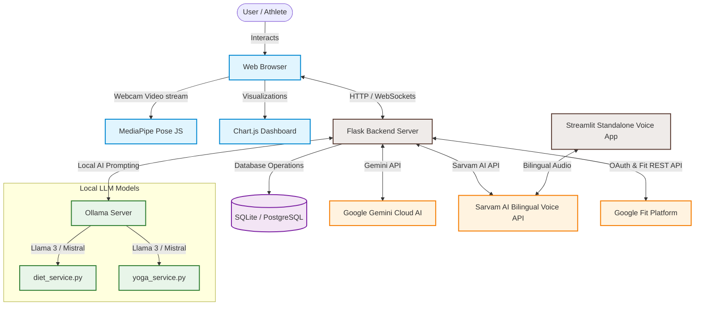
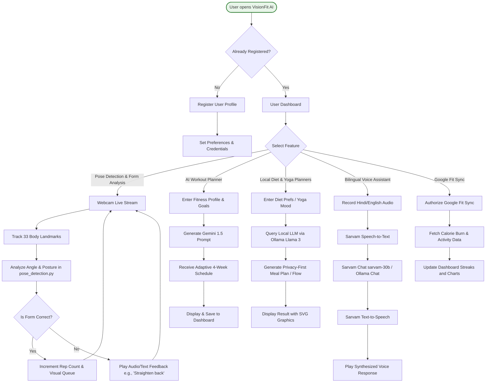

# VisionFit AI 🏋️‍♂️🥗🧘‍♀️

<div align="center">
  <p><strong>Your Personal, AI-Powered Digital AI Health & Fitness Coach.</strong></p>
  
  
  
  
  
  
  
</div>

<br/>

**VisionFit AI** is a comprehensive health and fitness platform that bridges the gap between state-of-the-art computer vision and advanced Generative AI (Google Gemini & Local LLMs via Ollama) to bring you a hyper-personalized fitness experience. Unlike standard fitness apps, VisionFit AI observes your form, plans your meals, curates your yoga flows, and coaches you locally in multiple languages.

---

## 📸 Project Showcase

*(Replace the placeholder links with actual screenshots of your application)*

| Dashboard & Tracking | Pose Detection (Live) | Workout AI Generation |
| :---: | :---: | :---: |
|  |  |  |

---

## 🚀 Key Features

### 1. 📹 Real-Time Pose Detection & Form Analysis
- **Powered by:** MediaPipe & OpenCV
- **Functionality:** Tracks 33 body landmarks in real-time continuously via your webcam.
- **Capabilities:**
  - **Pushups:** Scrutinizes depth, arm angle, and back posture.
  - **Squats:** Monitors hip-knee alignments and squat depth.
  - **Jumping Jacks:** Inspects coordination and range of motion.
- **Feedback Loop:** Reps are only counted if the form is correct. The system delivers instant visual and audio queues (e.g., "Keep your back straight").

### 2. 🤖 AI Workout Planner
- **Powered by:** Google Gemini (1.5 Pro / Flash)
- **Functionality:** Dissects your fitness profile (current levels, equipment, goals, physical limitations) to formulate adaptive 4-week workout regimes.

### 3. 🍎 AI Diet Planner (Offline/Local Priority)
- **Powered by:** Local LLMs via **Ollama** (Llama 3, Mistral) with Cloud fallbacks.
- **Functionality:** Synthesizes 1-day meal plans broken down by caloric and macronutrient targets. It fully accommodates dietary restrictions (Paleo, Vegan, Keto, etc.).
- **Privacy First:** Data stays on your machine during inference.

### 4. 🧘 AI Yoga Instructor
- **Powered by:** Local LLMs via **Ollama**.
- **Functionality:** Composes custom Yoga flows corresponding to your emotional state (stress, energy), core goals, and physical mobility ("Chair Yoga", "Bed Yoga"). Includes SVG graphics for standard poses.

### 5. 🎤 Bilingual AI Fitness Chat & Voice Assistant
- **Powered by:** Google Gemini & Local LLMs + `langdetect`.
- **Functionality:** In-app real-time conversational interface mapping both **Hindi** and **English**. Talk to your digital coach as naturally as a human without needing third-party cloud APIs.
- **Bonus:** Standalone Streamlit integration with **Sarvam AI** for advanced regional voice support.

### 6. 📊 Intuitive Dashboard & Google Fit Sync
- **Capabilities:** Interactive Chart.js data visualizations for your workout streaks, calorie burns, and performance history.
- **Third-Party Sync:** Deep linking with Google Fit API for automated physical activity ingestion.

---

## 🛠️ Technology Stack

| Layer | Technologies |
| --- | --- |
| **Backend Framework** | Flask, Python 3.8+, Flask-Login, Flask-Session |
| **Database** | SQLite (Dev), PostgreSQL (Prod) via SQLAlchemy |
| **Frontend** | HTML5, CSS (Bootstrap 5), Vanilla Javascript, Chart.js |
| **Computer Vision** | OpenCV, Google MediaPipe, Pillow, NumPy |
| **Cloud AI Models** | Google GenAI API (Gemini Series) |
| **Local AI Models** | Ollama (Llama 3, Mistral, Gemma, etc.) |
| **Integrations** | Google Auth OAuthlib, Google Fit REST API, Sarvam AI |

---

## ⚙️ Installation & Setup

### Prerequisites
- Python 3.8+
- Webcam for Pose Detection
- [Ollama](https://ollama.com/) *(Optional: Required for privacy-first, local offline features)*
- Google Cloud Project with Gemini API and Fit API enabled.

### 1. Clone the Repository
```bash
git clone https://github.com/yourusername/VisionFitAi.git
cd VisionFitAi
```

### 2. Set Up Virtual Environment
```bash
# Windows
python -m venv .venv
.venv\Scripts\activate

# macOS/Linux
python3 -m venv .venv
source .venv/bin/activate
```

### 3. Install Dependencies
```bash
pip install -r requirements.txt
```

### 4. Configure Environment Variables
Create a `.env` file in the root directory by copying the example template:
```bash
cp .env.example .env
```
*(If on Windows use `copy .env.example .env`)*

**Required Variables (`.env`):**
```ini
# Flask Security
SESSION_SECRET=your_super_secret_key_here

# Database URI
DATABASE_URL=sqlite:///visionfit.db

# Google Gemini API
GOOGLE_API_KEY=your_google_gemini_api_key

# Google Fit Configuration (Optional but recommended)
GOOGLE_CLIENT_ID=your_client_id
GOOGLE_CLIENT_SECRET=your_client_secret
GOOGLE_REDIRECT_URI=http://localhost:5000/oauth2callback
```

### 5. Launch Local AI Inference (Ollama)
For your Diet and Yoga AI generations to run locally without internet constraints:
1. Download [Ollama](https://ollama.com/).
2. Pull the designated model (Llama3 recommended):
   ```bash
   ollama pull llama3
   ```
   *The system is model-agnostic and will detect the ones you have locally automatically.*

### 6. Run the Application

You have multiple avenues to boot up VisionFit AI:

- **Windows Auto-Boot:**
  ```bash
  run_visionfit.bat
  ```
- **Cross-Platform Launcher:**
  ```bash
  python start_app.py
  ```
- **Standard Flask Dev Server:**
  ```bash
  python app.py
  ```

Open your browser to:
- **Main Platform:** `http://localhost:5000`
- **Voice Agent:** `http://localhost:5000/voice-assistant`

---

## 🎙️ Standalone Sarvam AI Voice Interface (Optional)

We also provide an independent Streamlit application focused rigorously on voice-native interactions leveraging **Sarvam AI**.

1. Install auxiliary requirements:
   ```bash
   pip install -r requirements-voice-chatbot.txt
   ```
2. Make sure to define `SARVAM_API_KEY` in your `.env`.
3. Launch Streamlit:
   ```bash
   streamlit run voice_chatbot_app.py
   ```

---

## 📂 Project Architecture

```text
VisionFitAi/
├── app.py                  # Core Application Factory (includes Ollama auto-starter)
├── routes.py               # Main Controllers & Blueprint definitions
├── models.py               # SQLAlchemy Database schemas
├── pose_detection.py       # OpenCV & MediaPipe pipeline logic
├── gemini.py               # Google GenAI wrappers
├── diet_service.py         # Ollama Local Diet Logic
├── yoga_service.py         # Ollama Local Yoga Flows
├── google_fit_service.py   # Synchronizations & OAuth flows
├── voice_service.py        # Bilingual TTS/STT and routing
├── start_app.py            # Orchestrator & Boot sequence 
├── templates/              # Jinja2 HTML Views
└── static/                 # Stylesheets, JS, Static Assets
```

---

## 📊 System Architecture & Application Flow

To help you understand how **VisionFit AI** bridges real-time computer vision, local/cloud AI services, and database persistence, here is the architectural blueprint:

### ⚙️ System Architecture



### 🔄 Application Workflow Flowchart

Below is the user flow for key system operations, illustrating decision trees for Form Analysis, AI Generation, Voice Assistant, and Google Fit Sync:



---

## 🤝 Contributing
Open-source contributions are actively encouraged. Please fork the repository, cut a feature branch, and submit a detailed Pull Request.

## 📄 License
This platform is published under the [MIT License](LICENSE).